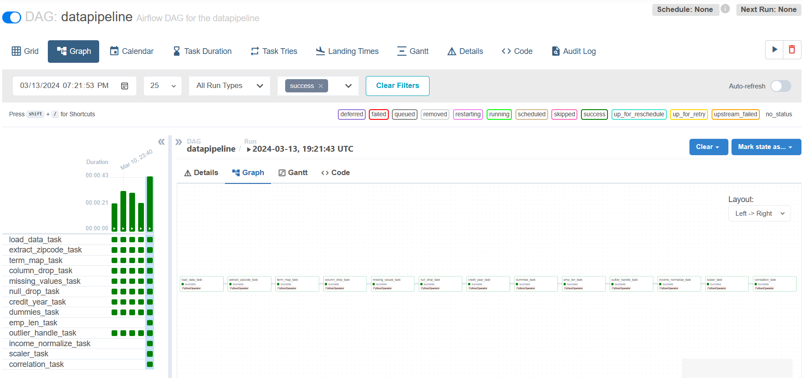
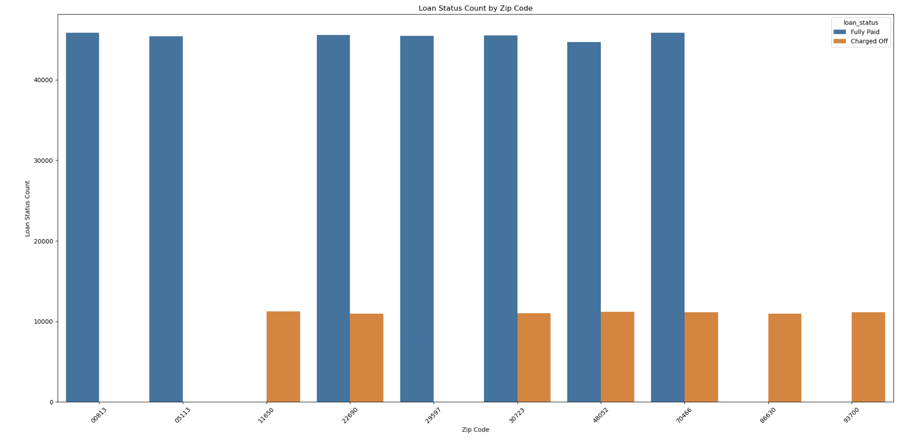
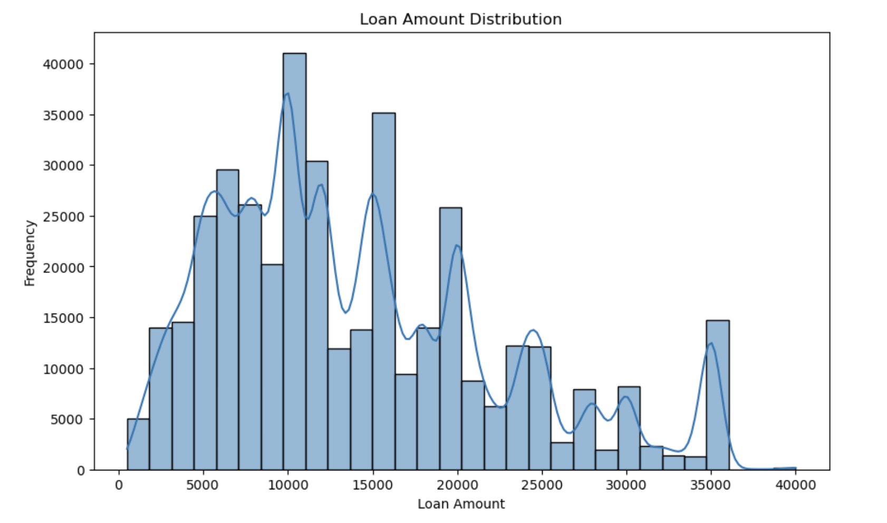
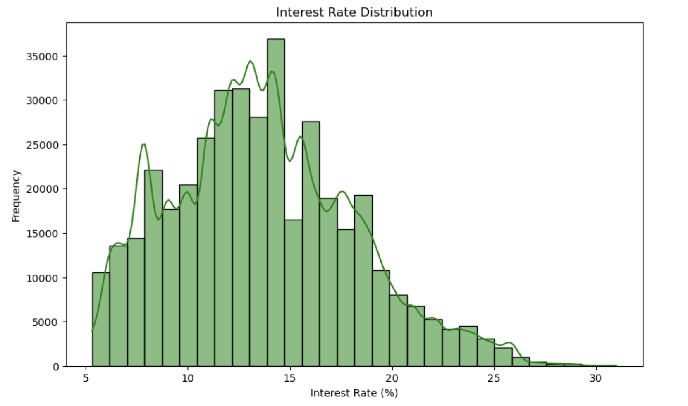
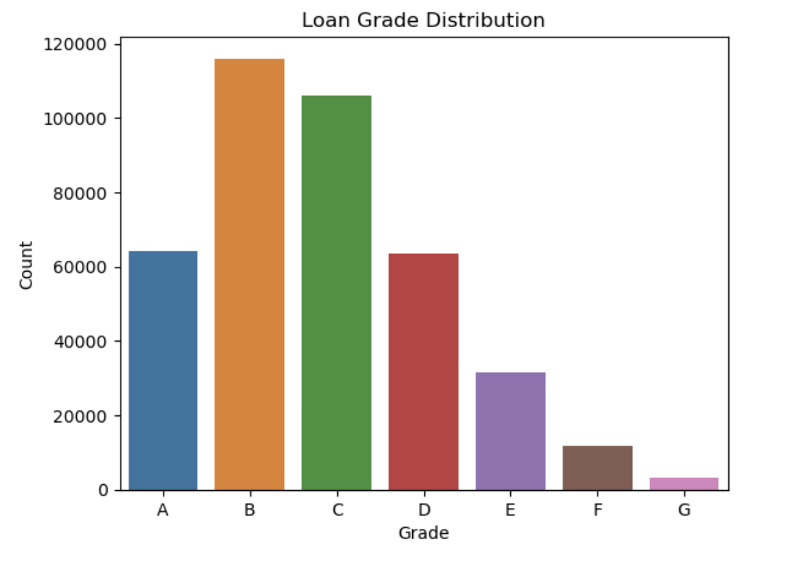
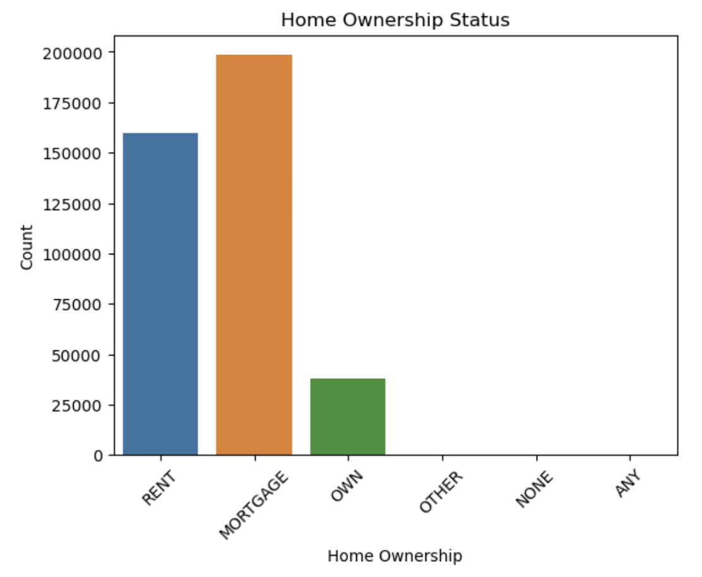
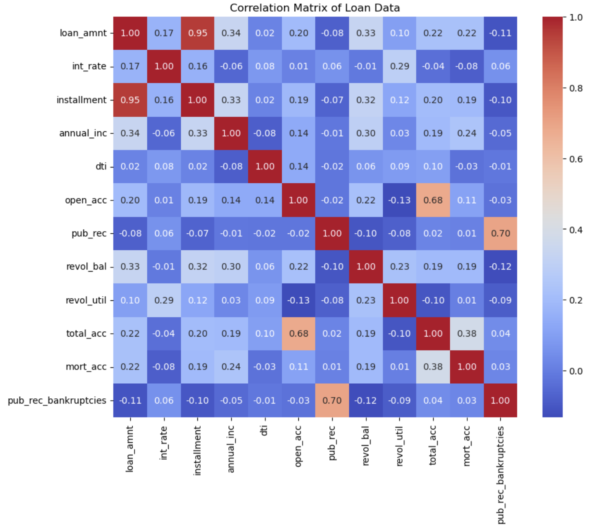
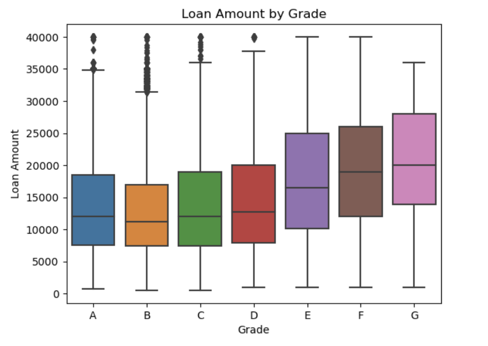
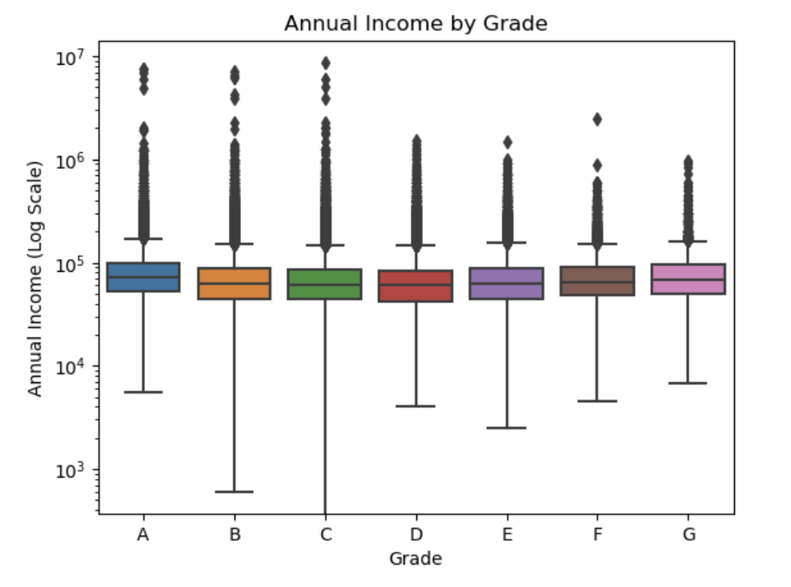

# Data

## 1. Dataset Information:
The dataset consists of 28 features for each applicant where loan_status is our target variable. The target variable has Fully_Paid and Charged_Off values indicating that the applicant either paid back the entire loan on time or missed all payments. Here Charged_Off is the class of interest as we want to identify potential risks in time.

## 2. Data Card:
The dataset has 396,030 entries where each entry corresponds to one applicant. There are 12 numeric features and 16 categorical features.

## 3. Data Sources:
The dataset is a public dataset owned by [Lending Club](https://www.lendingclub.com/personal-savings/founder-savings)

Below is the URL for data:

[Dataset Link](https://www.kaggle.com/code/faressayah/lending-club-loan-defaulters-prediction/input?select=lending_club_loan_two.csv)

We have structured our data pipeline into distinct modules, starting from data ingestion through preprocessing, ensuring that our data is well-prepared for modeling purposes. To ensure the functionality of each module, we adopt Test Driven Development (TDD) principles, rigorously testing every aspect of our pipeline.

Our data pipeline is orchestrated using Apache Airflow, where we design a Directed Acyclic Graph (DAG) comprising our modularized components. This approach streamlines the execution of our pipeline and enhances its scalability and reliability.

## 4. Exploratory Data Analysis:

- Loan Status across zip-codes 

The bar chart provides a visual comparison of loan status counts across various zip codes. The blue bars represent the count of loans that have been fully paid, and the orange bars indicate the count of loans that have been charged off, which typically means the borrower has defaulted on the loan.
It appears that loans are predominantly being fully paid across all zip codes shown, as the blue bars are significantly taller than the orange bars in each case. This suggests a general trend of loans being repaid rather than defaulting.

- Loan Amount

The distribution of loan amounts appears to be multimodal, with several peaks indicating common loan amounts that are more frequently given out. The most prominent peaks are seen at around $10,000 and just below $20,000, suggesting that these amounts are the most common among the loans in this dataset. There are smaller peaks as well, which could indicate other common loan amounts.
Additionally, there are fewer loans with higher amounts, as indicated by the decrease in frequency as the loan amount increases. The frequency of loans above $30,000 is quite low compared to lower loan amounts, which is typical since larger loans are less commonly issued.
The distribution is not symmetrical; it's skewed to the right, meaning that there are more loans of lower amounts and fewer loans of higher amounts. This is a typical pattern for financial data as fewer borrowers take out larger loans.
Overall, this analysis can help financial institutions understand the most common loan amounts they manage, which could influence product offerings, risk management, and marketing strategies.

- Interest Rate

This Interest-Rate histogram with an overlaid line graph displays the distribution of interest rates for loans in the dataset. 
The distribution appears right-skewed, indicating that a majority of the loans have lower interest rates, with fewer loans having higher interest rates. The peak of the distribution is around 10-15%, suggesting that the most common interest rates for these loans fall within this range. The frequency then decreases as the interest rate increases, with very few loans having interest rates above 25%.
The shape of the distribution might suggest that borrowers with better credit profiles, who typically receive lower interest rates, are well-represented in this dataset, or it could reflect the lending institution's general risk assessment and pricing strategy. High-interest rates are less frequent, which could mean the institution limits high-risk lending or that fewer borrowers qualify for or accept loans at higher rates.

- Loan Grade

This distribution  indicate that the lender's portfolio is weighted towards borrowers with moderate to high creditworthiness, with fewer loans extended to those with lower credit scores. It reflects a typical risk profile for many lending institutions, which may aim to balance loan volume with risk management by limiting exposure to high-risk loans.
 
 
We observe the following:
The most common loan grade is 'B', followed closely by 'C', indicating a concentration of loans in the mid-credit tier.
Loan grade 'A', which represents the highest creditworthiness, has the third-highest count of loans, suggesting that a significant number of borrowers have good credit profiles.
There is a steady decline in the count of loans from grade 'C' to 'D' and then a more pronounced drop-off from 'D' to 'E'.
The least common grades are 'F' and 'G', which represent the lowest creditworthiness and are substantially less frequent compared to the higher grades.

-  Home Ownership

This depicts the count of loans by the home ownership status of the borrowers. The categories include 'RENT', 'MORTGAGE', 'OWN', 'OTHER', 'NONE', and 'ANY'.

The majority of loans are held by borrowers with a mortgage, indicating they are homeowners paying off a home loan.
The next largest group of borrowers are those who rent their homes.
A significantly smaller number of loans are taken out by borrowers who fully own their homes without a mortgage.
Very few loans are associated with the 'OTHER', 'NONE', and 'ANY' categories.
This distribution might reflect the credit profile or stability associated with borrowers who have mortgages, as they might be perceived as more creditworthy by lenders. It could also suggest that borrowers with mortgages or those who rent are more likely to seek loans, possibly reflecting their financial needs or goals. The 'OTHER', 'NONE', and 'ANY' categories are less common, which could be due to these statuses being less typical or less likely to apply for or receive loans.

- 

- 

- 

## 5. Airflow Setup:

In our data preprocessing workflow, Apache Airflow plays a critical role in automating and orchestrating tasks seamlessly. Leveraging Airflow's capabilities, we have designed a robust workflow automation system that manages Directed Acyclic Graphs (DAGs) efficiently.

The Airflow platform, built with Python, streamlines the execution of data preprocessing tasks, such as data ingestion, cleaning, transformation, and feature engineering. By defining tasks and their dependencies within Airflow's DAGs, we ensure that each step is executed in the correct sequence, optimizing the overall data preprocessing process.

Airflow's scheduler and web server components enable us to monitor and manage our workflows through a user-friendly web interface. This interface allows us to visualize the workflow, track task statuses, and troubleshoot any issues that may arise during execution. Below is the link to our code.

[Airflow Code Link](https://github.com/neelanap1999/MLOPSPROJECT/blob/main/dags/airflow.py)

## 6. Data Pipeline Components:

This project's data pipeline comprises multiple interconnected modules, each dedicated to executing specific data processing tasks. Our approach involves utilizing Airflow and Docker to orchestrate and encapsulate these modules within containers. Each module serves as an individual task within the primary data pipeline DAG (datapipeline), contributing to the seamless execution and management of our data processing workflows. The below chart explains that well. 

1. Preprocessing Data: During this stage, the dataset undergoes several cleaning and preprocessing procedures to guarantee data quality and prepare it for analysis. The subsequent modules participate in this operation.

- dataload.py - Script for loading and importing data into the pipeline.
- data_pipeline.py - Module responsible for orchestrating the data processing pipeline workflow.
- column_drop.py - Handles dropping unnecessary columns from the dataset during preprocessing.
- missing_values.py - Manages the handling of missing values through imputation or removal strategies.
- null_drop.py - Manages null values by dropping rows or columns containing null values.
- outlier_handle.py - Implements techniques to identify and handle outliers in the dataset to improve data quality.
    
2. Feature Engineering : During this phase, we engage in feature engineering to analyze and enhance the features, aiming to improve training outcomes and evaluation metrics. The subsequent modules are developed specifically for feature engineering purposes.

- correlation.py - Calculates and analyzes correlations between different features in the dataset.
- credit_year.py - Extracts credit years from timestamps and performs relevant data transformations.
- dummies.py - Generates dummy variables for categorical features using one-hot encoding.
- income_normalization.py - Normalizes income data to ensure consistency and comparability across different scales.
- pca.py - Applies Principal Component Analysis (PCA) to reduce dimensionality and extract essential features.
- scaling.py - Performs feature scaling to standardize numerical features and improve model performance.
- term_map.py - Maps and categorizes loan terms for better analysis and modeling.
- transform_emp_length.py - Transforms employment length data for better understanding and utilization in models.
- zipcode_extract.py - Extracts relevant information from zip codes for geographical analysis and modeling purposes.

