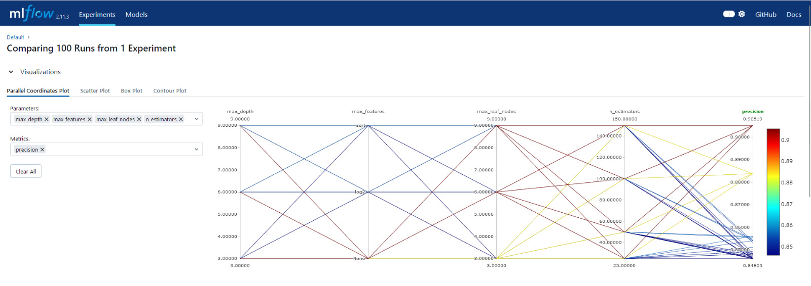
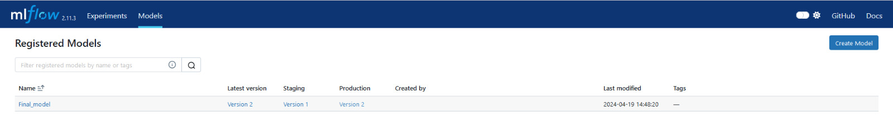

# Machine Learning Modeling Pipeline

We have implemented our machine learning pipeline on Google Cloud Platform (GCP). We added our codebase, and we built images using Docker. Subsequently, we pushed the Docker images to the Artifact Registry. We then trained and served our model using Vertex AI.

## Machine Learning Pipeline Components
### 1. Trainer

### 2. Serve

### 3. Model Pipeline
- `build.py` : Will create a training job using the images from the above trainer and serve in Vertex AI. At the end of the job it wil deploy to the endpoint where it will serve the model.

### 4. Inference
- `inference.py : It will send a json input to the model to predict the results.

## Experimental tracking pipeline (MLFLOW)

For tracking our experimental machine learning pipeline, we use MLflow, Docker, and Python.

We chose Precision score (higher the better) to choose our final model parameters from the plot below.

## Staging, Production and Archived models (MLFLOW)
We rely on MLflow for managing models for Archiving, Staging, and Production as it allows us to reuse the models from artifacts regietry and serve it on a predefined port on-the-go. Our 

## Model Pipeline
   #### Train the model 
   The model is trained using Random Forest Classifier. 
   
   #### Save the model 
   The model is saved locally using save_and_upload_model function and uploaded to GCS.
   
   #### Hyper Parameter Tuning
   The model has four hyper-parameters namely n_estimators, max_leaf_nodes, max_depth, max_features.
   
  #### Model Analysis 
  The model is analysed by the Silhouette_Analysis function.

  
  #### Model Efficacy Report and Visuals  
