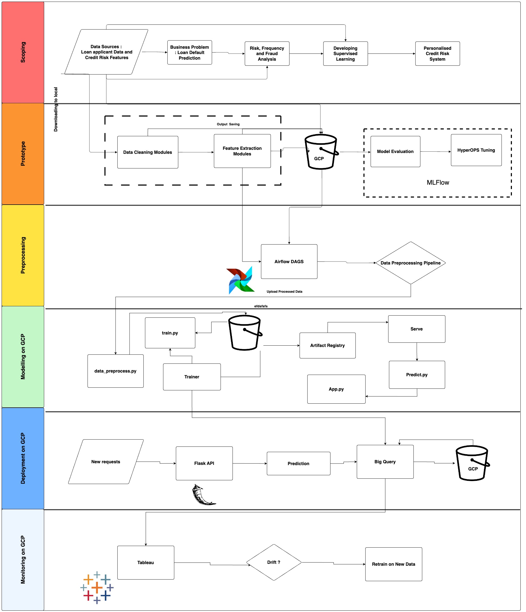
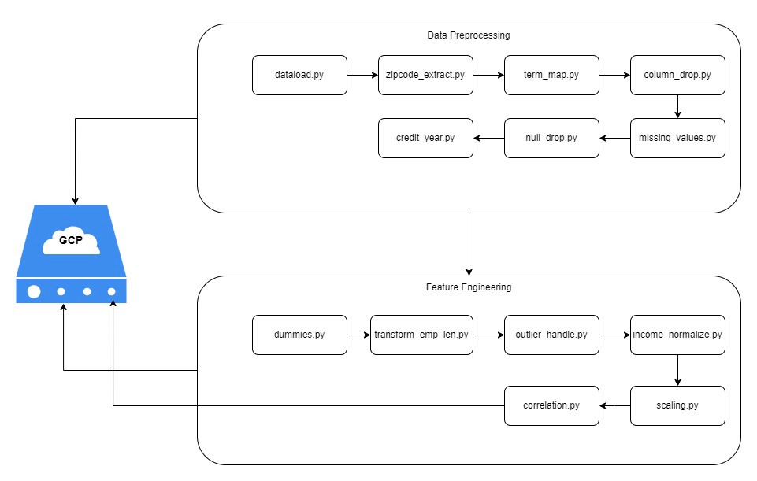
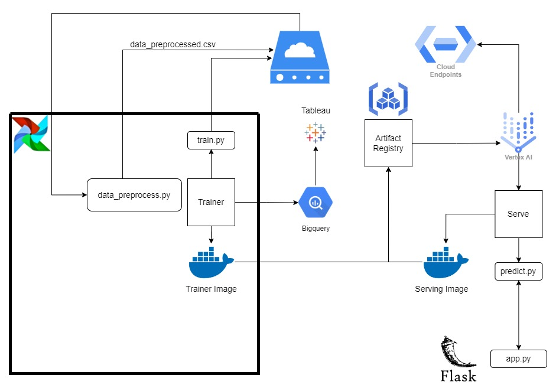
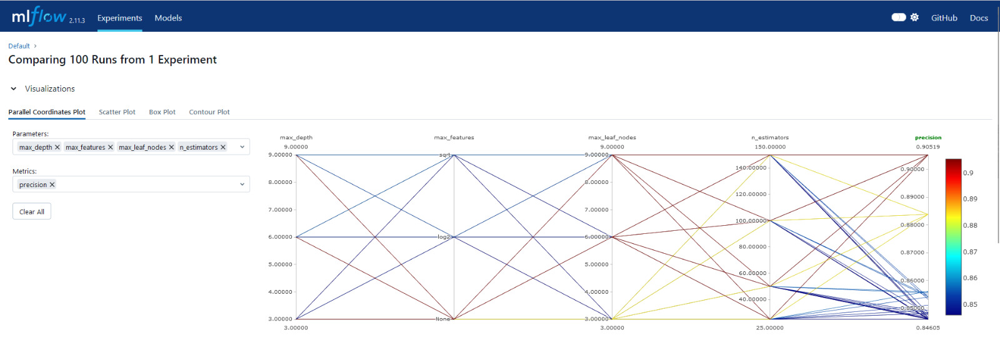
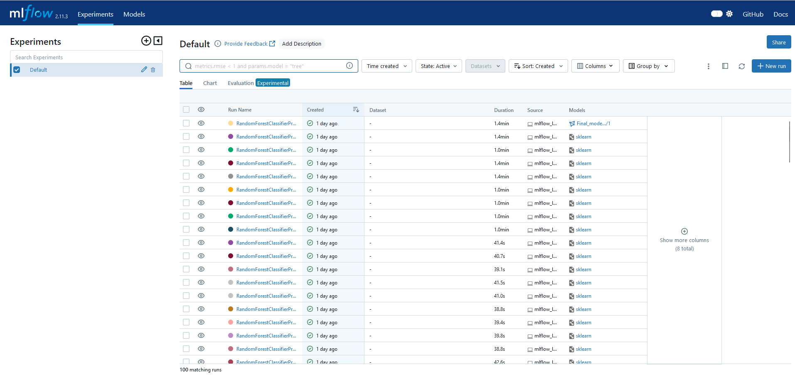
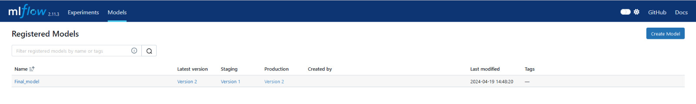

# Credit Risk Assessment - MLOps

[Kush Suryavanshi](https://github.com/Kush210/)  | [Aryan Fernandes](https://github.com/aryanf12122000/) | [Naveen Pasala](https://github.com/Naveen2627-hub)  |  [Shiva Naga Jyothi Cherukuri](https://github.com/ShivaNagaJyothi-Cherukuri/)  | [Neel Shirish Anap](https://github.com/neelanap1999/)  | [Vishesh Gupta](https://github.com/visheshgupta-BA/)


<p align="center">  
    <br>
	<a href="#">
	
         
         
         
         
 
  </a>	
</p>
<br>


## 1. Introduction

Assessing credit risk is a critical task for any lending institution. That's why we've embarked on an ambitious project that combines the latest machine learning innovations with modern software engineering best practices. Our goal? To build a robust, scalable system capable of accurately predicting loan outcomes.

At the heart of our approach lies a powerful stack of tools and technologies. We're harnessing the flexibility of Python and the might of frameworks like TensorFlow to construct highly accurate predictive models. But we're not stopping there – we're employing cutting-edge techniques like transfer learning, ensemble methods, and neural architecture search to push the boundaries of model performance.

What truly sets our project apart, however, is its holistic nature. We've engineered an automated pipeline that streamlines the entire data science lifecycle, from data ingestion and preprocessing to model deployment and monitoring. With orchestration tools like Airflow and data processing engines like Google Cloud Dataflow, we've achieved unparalleled levels of automation, scalability, and reproducibility.

Embracing the principles of DevOps, we've adopted containerization with Docker, continuous integration and deployment with GitHub Actions, and rigorous testing with Tensorflow. Version control with Git and experiment tracking with MLflow foster an environment of collaboration, iteration, and knowledge-sharing among our team of data scientists and engineers.

Our ultimate goal? To deliver a best-in-class lending experience that empowers both borrowers and lenders. By combining machine learning innovation with software engineering excellence, we're poised to transform the credit risk assessment landscape, ensuring accurate decision-making, regulatory compliance, and a superior overall experience for all stakeholders.

---

## 2. Dataset Information

### 2.1. Dataset Introduction:
The dataset consists of 28 features for each applicant where loan_status is our target variable. The target variable has Fully_Paid and Charged_Off values indicating that the applicant either paid back the entire loan on time or missed all payments. Here Charged_Off is the class of interest as we want to identify potential risks in time.

### 2.2. Data Card:
The dataset has 396,030 entries where each entry corresponds to one applicant. There are 12 numeric features and 16 categorical features.

| Variable Name | Role | Type | Description |
|---------------|------|------|-------------|
| loan_amnt | Feature | Continuous | The listed amount of the loan applied for by the borrower. If at some point in time, the credit department reduces the loan amount, then it will be reflected in this value. |
| term | Feature | Categorical | The number of payments on the loan. Values are in months and can be either 36 or 60. |
| int_rate | Feature | Continuous | Interest Rate on the loan |
| installment | Feature | Continuous | The monthly payment owed by the borrower if the loan originates. |
| grade | Feature | Categorical | LC assigned loan grade |
| sub_grade | Feature | Categorical | LC assigned loan subgrade |
| emp_title | Feature | Categorical | The job title supplied by the Borrower when applying for the loan. |
| emp_length | Feature | Ordinal | Employment length in years. Possible values are between 0 and 10 where 0 means less than one year and 10 means ten or more years. |
| home_ownership | Feature | Categorical | The home ownership status provided by the borrower during registration or obtained from the credit report. Our values are: RENT, OWN, MORTGAGE, OTHER |
| annual_inc | Feature | Continuous | The self-reported annual income provided by the borrower during registration. |
| verification_status | Feature | Categorical | Indicates if income was verified by LC, not verified, or if the income source was verified |
| issue_d | Feature | Date | The month which the loan was funded |
| loan_status | Feature | Categorical | Current status of the loan |
| purpose | Feature | Categorical | A category provided by the borrower for the loan request. |
| title | Feature | Categorical | The loan title provided by the borrower |
| zip_code | Feature | Categorical | The first 3 numbers of the zip code provided by the borrower in the loan application. |
| addr_state | Feature | Categorical | The state provided by the borrower in the loan application |
| dti | Feature | Continuous | A ratio calculated using the borrower's total monthly debt payments on the total debt obligations, excluding mortgage and the requested LC loan, divided by the borrower's self-reported monthly income. |
| earliest_cr_line | Feature | Date | The month the borrower's earliest reported credit line was opened |
| open_acc | Feature | Integer | The number of open credit lines in the borrower's credit file. |
| pub_rec | Feature | Integer | Number of derogatory public records |
| revol_bal | Feature | Continuous | Total credit revolving balance |
| revol_util | Feature | Continuous | Revolving line utilization rate, or the amount of credit the borrower is using relative to all available revolving credit. |
| total_acc | Feature | Integer | The total number of credit lines currently in the borrower's credit file |
| initial_list_status | Feature | Categorical | The initial listing status of the loan. Possible values are – W, F |
| application_type | Feature | Categorical | Indicates whether the loan is an individual application or a joint application with two co-borrowers |
| mort_acc | Feature | Integer | Number of mortgage accounts. |
| pub_rec_bankruptcies | Feature | Integer | Number of public record bankruptcies |


### 2.3. Data Source:
The dataset is a public dataset owned by [Lending Club](https://www.lendingclub.com/personal-savings/founder-savings)

Attached is the URL for data:
[Dataset Link](https://www.kaggle.com/code/faressayah/lending-club-loan-defaulters-prediction/input?select=lending_club_loan_two.csv)

---

# Setup Instructions
Please confirm that `Python >= 3.8` or a later version is present on your system prior to installation. This software is designed to be compatible with Windows, Linux, and macOS platforms.

# Prerequisities
1. git
2. python>=3.8
3. docker daemon/desktop is running
4. apache-airflow==2.8.3
5. Flask==2.2.5

## Installation Steps for Users
To install for users, follow these steps:

1. Clone the repository to your local machine:
```
git clone https://github.com/neelanap1999/MLOPSPROJECT.git
```
2. Ensure that your Python version is 3.8 or above:
```python
python --version
```
3. Check if your system has sufficient memory:
```docker
docker run --rm "debian:bullseye-slim" bash -c 'numfmt --to iec $(echo $(($(getconf _PHYS_PAGES) * $(getconf PAGE_SIZE))))'
```
<hr>
---

# Tools Used for MLOps

- Docker
- Airflow
- DVC
- Google Cloud Platform (GCP)
- MLflow
- Flask

## Docker and Airflow
Inside the `docker-compose.yaml` file, you'll find the necessary code to execute Airflow. Utilizing Docker and containerization enables us to package our data pipeline along with its essential dependencies. This ensures platform independence, allowing our data pipeline to operate seamlessly on Windows, macOS, or Linux systems.

## DVC
Data Version Control facilitates the versioning of datasets and machine learning models, capturing snapshots of the data utilized in training and its associated code. This capability enables reproducibility and traceability, ensuring the ability to recreate any past state of your project. DVC exclusively stores metadata, while the actual data resides in cloud storage or other remote locations. By seamlessly integrating with Git, DVC enables the utilization of Git repositories for code management and DVC repositories for data and model management. This dual-repository method aids in maintaining a tidy and efficient codebase.


## MLFlow
MLflow empowered us with a unified and reproducible setup for exploring supervised learning algorithms. It facilitated us effortless tracking, comparison, and storage of various parameters, metrics, experiments, and machine learning models as reusable artifacts. MLflow seamlessly integrated with frameworks such as scikit-learn and TensorFlow, enabling efficient model tuning by visualizing optimal parameter sets to enhance each metric.

## Flask

Flask API serves as the backbone for creating a user-friendly interface to interact machine learning model. It enables users to generate sample data from the test dataset and trigger the prediction pipeline seamlessly through a web interface. With Flask API, users can initiate predictions with just a click and receive the results in real-time, enhancing the overall usability and accessibility of our machine-learning application.

## Google Cloud Platform (GCP)

Our data version control is managed and hosted on the Google Cloud Platform (GCP). GCP seamlessly handles the hosting and versioning of large datasets, facilitating the development of robust ETL pipelines. With support for concurrent access and updates by multiple users, coupled with built-in versioning, retrieving older versions is effortless.

GCP enabled us to efficiently implement the ETL process while preserving intermediary files for each modularized task.

1. To leverage Google Cloud Platform services, simply initialize a service account.
2. Similar to other remotes, downloading an SSH key is required for remote access.


Pictured: Our data files tracked by DVC in GCP

---

## Overall ML Project PipeLine


## Data Pipeline
We've structured our data pipeline into modular components, spanning from data ingestion to preprocessing, ensuring our data is primed for modeling. Each module undergoes rigorous testing, adhering to the principles of Test Driven Development (TDD), to ensure its smooth functioning.

Our pipeline is orchestrated using Apache Airflow, where we construct a Directed Acyclic Graph (DAG) incorporating these modules.


The following is the explanation of our Data pipeline DAG

## Data Pipeline Components



In this project, the data pipeline comprises numerous interconnected modules, each designed to execute distinct data processing tasks. We employ Airflow and Docker to organize and encapsulate these modules, with each one serving as a task within the primary data pipeline Directed Acyclic Graph (DAG) (`datapipeline`).

## 1. Downloading and Preparing Data:
The initial stage is to obtain the dataset and ready it for preprocessing. This involves the following scripts:

- `download_data.py`: Handles the downloading of the dataset from the provided online source.
- `dataload.py`: Loads the data into the working environment and verifies its integrity.

## 2. Data Cleaning and Preprocessing:
This phase is crucial as it involves cleaning the data to ensure its quality and effectiveness for analysis. The scripts involved are:

- `missing_values.py`: Detects and addresses missing data within the dataset.
- `dummies.py`: Converts categorical variables into dummy/indicator variables for analysis.
- `outlier_handle.py`: Identifies and manages outliers in the data.
- `scaling_data.py`: Scales the data, standardizing or normalizing values for better comparison.
- `column_drop.py`: Drops unnecessary columns ('grade', 'title', 'emp_title') from the dataframe.
- `null_drop.py`: Removes rows or columns with Null values to maintain dataset integrity.

## 3. Data Analysis:
Post-cleaning, our dataset is then analyzed to extract meaningful insights. The analysis scripts include:

- `correlation.py`: Investigates the correlation between different variables in the dataset.
- `pca.py`: Performs Principal Component Analysis for dimensionality reduction.

## 4. Data Transformation and Feature Engineering:
To improve model performance, we engineer and transform features using the following scripts:

- `extract_columns.py`: Extracts specific columns needed for further processing.
- `labelencode.py`: Encodes categorical labels with value between 0 and n_classes-1.
- `split.py`: Splits the dataset into training and testing sets.


The integration of these scripts ensures a seamless transition from raw data to insights, enabling us to derive maximum value from our data. Each script reads from a designated input path, processes the data, and outputs it to a specified output path, facilitating the creation of a robust and reproducible data pipeline.

<hr>

# Machine Learning Modeling Pipeline

We successfully established our machine learning pipeline on Google Cloud Platform (GCP). We uploaded our codebase, crafted Docker images, and securely stored them in the Artifact Registry. Following this, we proceeded to train and deploy our model using the powerful capabilities of Vertex AI.



## Machine Learning Pipeline Components

### 1. Data Ingestion and Preprocessing
This part of your pipeline deals with preparing the data for machine learning tasks. It includes several steps to manage and prepare your data:
- **data_preprocess.py**: This script imports data from Google Cloud Storage, processes it through several modules like handling missing values, encoding, and outlier removal, and finally writes the preprocessed data back to the cloud.

### Components

- **Modules**:
  - `extract_columns.py` - Extracts relevant columns.
  - `column_drop.py` - Drops unnecessary columns.
  - `missing_values.py` - Handles missing values.
  - `null_drop.py` - Removes rows with null values.
  - `dummies.py` - Converts categorical variables into dummy variables.
  - `outlier_handle.py` - Handles outliers in the data.
  - `labelencode.py` - Encodes labels with value between 0 and n_classes-1.
 

- **Feature Extraction**: Calculating statistics for normalization and saving them to Google Cloud Storage.
- **Google Cloud Storage (GCS)**: Utilized for storing raw data, processed data, and statistical data.

### 2. Trainer
This component includes training a machine learning model based on the preprocessed data:

- **trainer.py**: Creates the model and saves it on Google Cloud after using the train data from Google Cloud.
  - `Random Forest Classifier`: Used for predicting loan defaults.
  - `Data Normalization`: Using precomputed stats to normalize the data before training.
  - `Model Training and Evaluation`: Splits data into training and validation sets, trains a Random Forest model, and evaluates its performance.
  - `Google Cloud Storage`: Stores the trained model in a specified bucket.
  - `Dockerfile` : Used to host the training job.


### 3. Serving
The model trained in the previous step is served using a Flask application, making it possible to predict new instances in real-time:

- **predict.py**:
- `Flask Application`: To create endpoints for health checks and predictions.
- `Model Deployment`: Loads the trained model from GCS and predicts output for new incoming data in JSON format.
- `Environment Initialization`: Setting up Google Cloud client and other necessary configurations.
- - `Dockerfile`: Used to host the serving module.

### 3. Retraining
This Airflow DAG file orchestrates the execution of data_preprocess.py and train.py, ensuring they run sequentially. Scheduled to run every hour, it trains the model and stores the results in a Google Cloud bucket.


### 4. Model Monitoring
We're monitoring the precision and accuracy of the retrained models and storing this data in Google BigQuery. These statistics are then utilized to visualize the model performance in a Tableau dashboard, providing real-time tracking capabilities.


### 5. GCP Deploy
The training and prediction pipeline code has been dockerized and uploaded to the Artifacts Registry pipeline. The online serving pipeline is managed through Vertex AI.
- `serve/build.py` : Will create a prediction job using the images from the above  serve in Vertex AI. At the end of the job it wil deploy to the endpoint where it will serve the model.
- `trainer/build.py`:  A script to initiate training jobs, handle deployment on Google Cloud, and ensure the model is updated and served correctly.


<hr>

## Experimental tracking pipeline (MLFLOW)

For tracking our experimental machine learning pipeline, we use MLflow, Docker, and Python.

We chose the three metrics Davies-Bouldin Index(lower the better), Calinski-Harabasz Index(higher the better), and primarily Silhouette score(higher the better) to choose our final model parameters from the plot below.


Pictured: Parallel Plot for visualizing the parameter-metrics combinations for our model

## Staging, Production, and Archived models (MLFLOW)
We rely on MLflow for managing models for Archiving, Staging, and Production as it allows us to reuse the models from the artifacts registry and serve them on a predefined port on the go. Our 


Pictured: Existing Logs on MLFlow for all the Experimental Models



## Model Pipeline
   #### 1. Train the model 
   The model is trained using a Random Forest Classifier. It takes predictors and classifies the input record as Loan Approved or not based on different predictors.
   #### 2. Save the model 
   The model is saved locally using the save_and_upload_model function and uploaded to GCS.
   #### 3. Hyper Parameter Tuning
   The model has four hyper-parameters max_depth, max_features, max_leaf_nodes, n_estimators in model_analysis(). Also, we used MLFLOW for checking models with multiple parameters by changing above parameters.
  #### 4. Model Analysis 
  The model is analyzed using precision and accuracy as metrics. 

<hr>


## LOCAL DEPLOYMENT

We've developed a user interface using Flask API, named app.py, which enables users to generate sample data from the test dataset. Afterwards, users can initiate the prediction pipeline by clicking the 'predict' button on the UI, and view the response of the prediction pipeline directly on the UI.


Steps to run the User Interface:
1. Ensure you have the gcloud connection from your local terminal, if not use the below comments and authenticate.
    ```bash
    sudo snap install google-cloud-cli --classic
    gcloud auth login
    gcloud auth application-default login
    gcloud auth activate-service-account --key-file="dags/data/mlops-project.json"
    gcloud config set project mlops-project-9608-416822
    ```
2. Initially Run the Predict.py file which hosts a server in backend at ‘http://127.0.0.1:8080/predict’
    ```bash
    cd src/codedeploy/serve
    python3 predict.py
    ```
3. once predict.py is up and running then run app.py which host a server at http://127.0.0.1:5000/.
    ```bash
    cd src/UI_code
    python3 app.py
    ```
---  

## DVC SETUP

Steps for initializing and tracking files using DVC:

1. Initialize DVC in the parent directory of your local repository.
    ```bash
    dvc remote add -d temp /tmp/dvcstore
    ```

2. Configure a remote bucket.
    ```bash
    dvc remote add -d temp /tmp/dvcstore
    ```

3. Set the default location for your remote bucket.
    ```bash
    dvc remote add -d myremote gs://<mybucket>/<path>
    ```

4. Ensure to update your credentials.
    ```bash
    dvc remote modify --lab2 credentialpath <YOUR JSON TOKEN>
    ```
---  

## MLFlow SETUP

Key configurations in the code:

1. Specify the tracking URI for MLFlow.
    ```python
    mlflow.set_tracking_uri("http://127.0.0.1:5001")
    ```

2. Establish the logging threshold; only warnings and higher (errors, critical) will be logged.
    ```python
    logging.basicConfig(level=logging.WARN)
    ```

3. Configure the logger.
    ```python
    logger = logging.getLogger(__name__)
    ```

4. Additionally, you have the option to suppress warnings.
    ```python
    warnings.filterwarnings("ignore")
    ```
---

